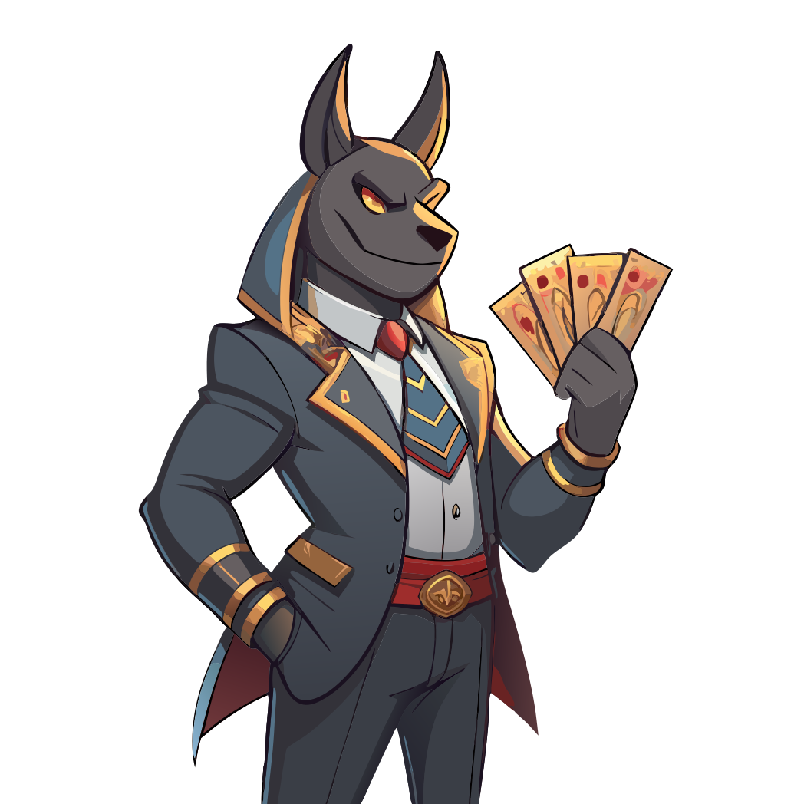

<!-- PROJECT LOGO -->
 

  

<h3 align="center">Seth Lottery</h3>

Built for <a href="https://app.buidlbox.io/starknet/starknet-winter">Starknet Winter Hackathon</a>

  

    A decentralized lottery game developed in Cairo.
     
     
    <a href="https://github.com/RegisGraptin/StarknetLottery">View Demo</a>
  

## About The Project

**Seth Lottery** is a decentralized lottery game developed using Cairo during the *Starknet Winter Hackathon*. The game allows players to enter in the Seth world where Chaos and Randomness reign supreme. To participate, players will have to choose 5 unique numbers, crafting their ticket to challenge the forces of chance.

The dApp is primarily designed for use on Telegram. However, due to potential stability issues, we recommend accessing it through a web browser for the best experience. The application is fully optimized for both platforms.

During each "contest," a unique set of numbers can only be used once, ensuring a unique potential winner. To maintain a transparent and equitable gaming experience, the lottery relies on Pragma Oracle in order to generate a random numbers.

After a lottery is completed, a new one can be initiated. Please note that tickets from previous lotteries are not carried over to subsequent contests.

## Getting Started

In this project, we will have two folders:

- `contract`: Starknet smart contract code.
- `telegram`: Telegram Mini app implementation.

## Contract

A smart contract have been deployed on starknet of sepolia. You can find it at this address: `0x058ec50072f4cb7587809f2c18cc216ca2c706f22d165128a0c1ca0e22175049`.

